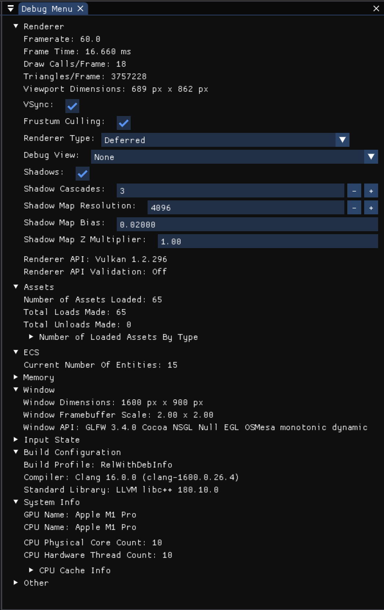
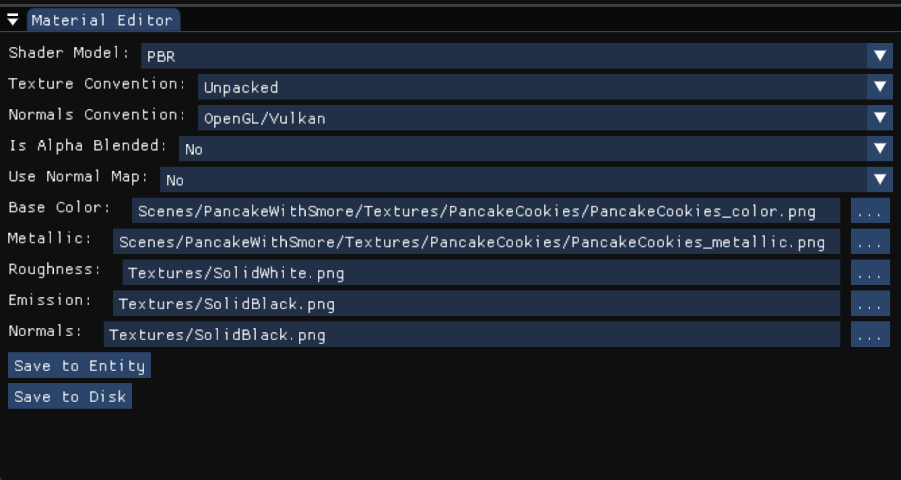
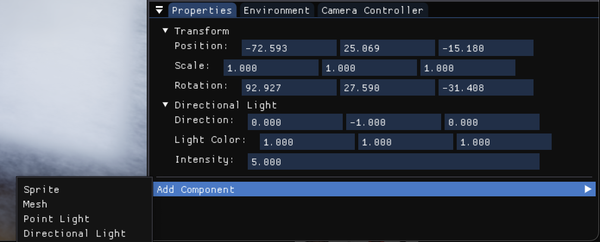
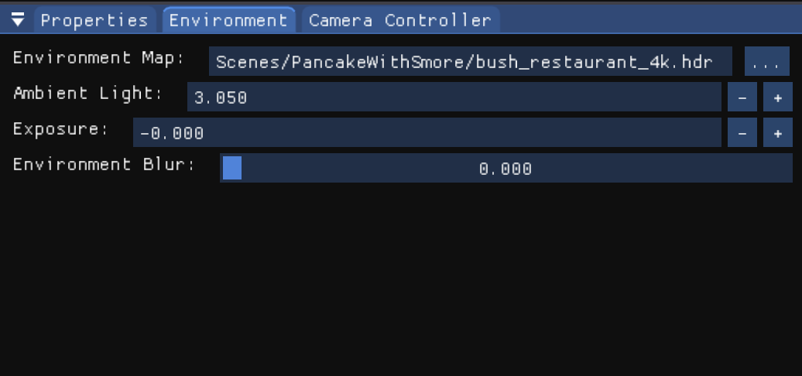
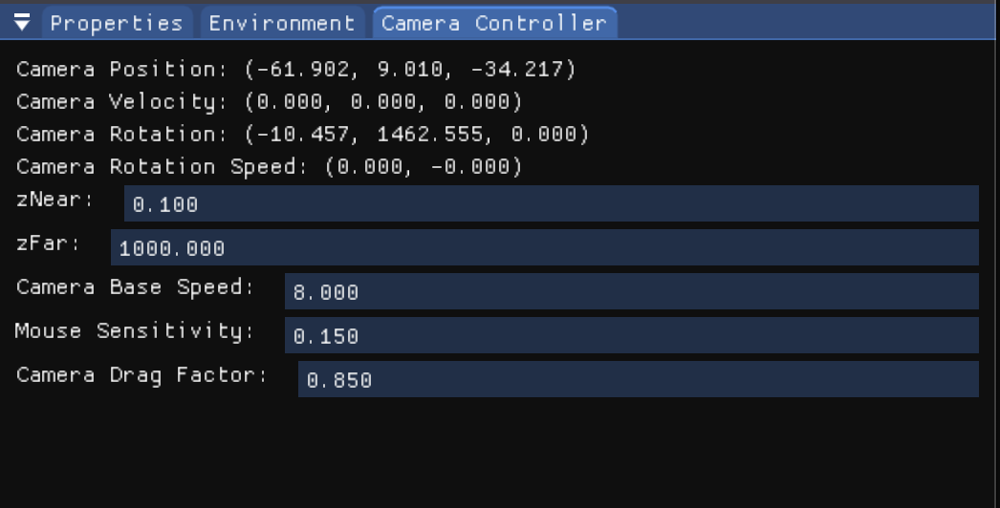

## Editor Features

#### Debug Menu

The Debug Menu gives you insights into the configuration and runtime stats of the engine. You can switch settings at
runtime and observe the changes right away. The menu covers information across many systems in the engine such as the 
Renderer, Asset Manager, ECS, Memory & Allocation stats, Window Manager, and Input State as well as information 
about the engine build and the CPU core count and cache sizes of the computer running.

#### Scenes

The Scenes system allows you to save your scene settings and scene hierarchy as well as all entity data to disk, allowing
for continuous development across multiple sessions of work. Saving your scene is as easy as clicking File -> Save Scene
and a save file dialog will appear allowing you to save your scene anywhere you want. Any assets used in the scene will 
have their file paths recorded into the scene file to be loaded when the scene is loaded. Note that the asset file paths
are relative to the set asset directory (which is currently not able to be set, so only the engine assets directory is used for demos).

#### Material Editor

The Material Editor allows you to create and edit materials and save them to disk. In addition to that, the material editor 
also allows you to view the material settings for each entity with a material. If you want to make changes or edits, you
can make edits on the entity level to test new changes. Furthermore, after any changes you make, you click one button to have it 
saved to disk.

#### Properties Panel

The Properties panel allows you to add components to an entity as well as view or edit component data for an entity. This
is the key to building scenes. Components define types of data that can be attached to an entity (aka game objects or actors).
Currently, the supported component types are Transform, Mesh, Material, Point Light, and Directional Light.

#### Environment Panel

The Environment panel allows you to view or edit environment settings for the scene. You can adjust which environment map is used,
the ambient light factor, exposure, and the blur of the environment map.

#### Camera Controller Panel

The Camera Controller panel allows you to view or edit settings for the main camera of the scene. You can adjust the speed, sensitivity,
z near, and z far distances. 

