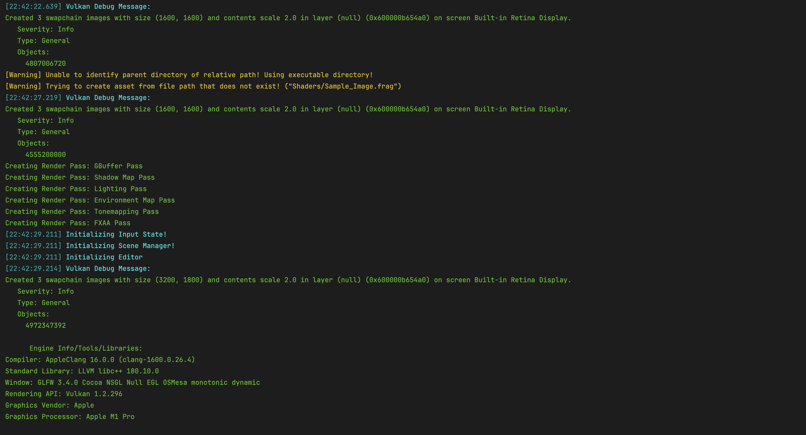
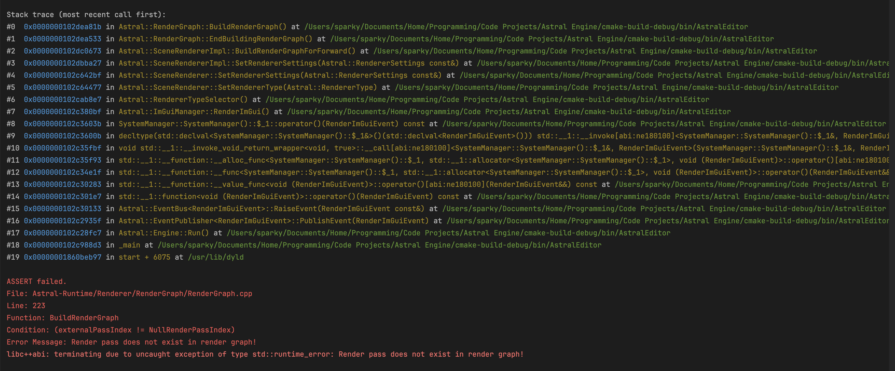
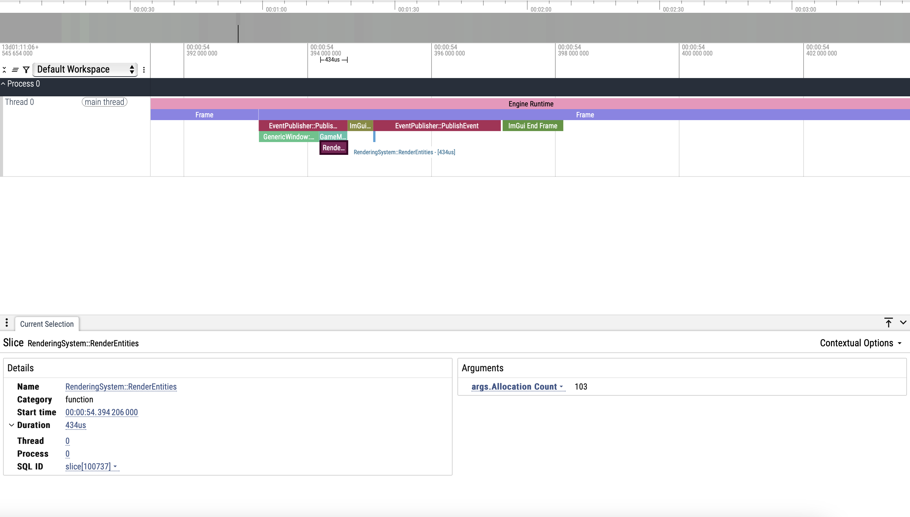
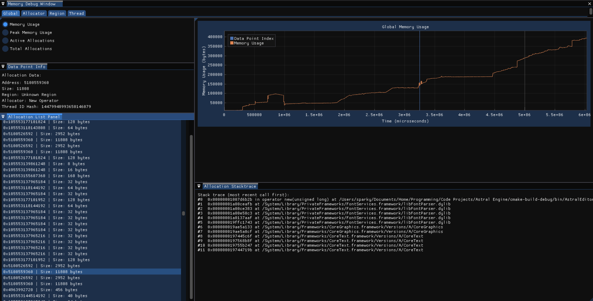

## Debugging Features

#### Loggers

Logging macros are defined for simple color coded messaging which cover info messages, time stamped messages, and warning messages.
This allows for quick scans through the log to see if any warnings or any other important information is seen and delt with.
Furthermore, messages logged through the macros are also logged to a file on disk for viewing after the application closes.

#### Assert & Error

The Astral Engine codebase makes extensive use of defensive programming and ASSERTs are commonly used throughout systems.
There are two macros, AE_ASSERT and AE_ERROR, that can be used to make sure inputs fall within expected values to catch
errors early. These macros are only defined in Debug and RelWithDebInfo builds

#### Scope Profiler

A scope profiler macro is defined using RAI and std::chrono for profiling scopes and functions. Its easy to use and gives
a ton of useful information in a visual format that you can use to see which areas of your code are taking the longest. It
is also integrated with the memory tracking system such that you can get the number of allocations made in any given scope
that you profile.

#### Memory Allocation Profiler

A visual interface integrating memory allocation metrics from the memory tracking system to provide an overview of every 
allocation made between two points in time. The memory tracking system overrides the new and delete operators and provides
a thread-safe scene-based tracking system that collects metrics and a stacktrace when an allocation occurs and eventually writes that
to a file to be read from later by this interface. This interface provides tons of useful information to track down allocations
and find where hotspots of memory allocations are happening to help reduce unnecessary allocations to improve performance.

