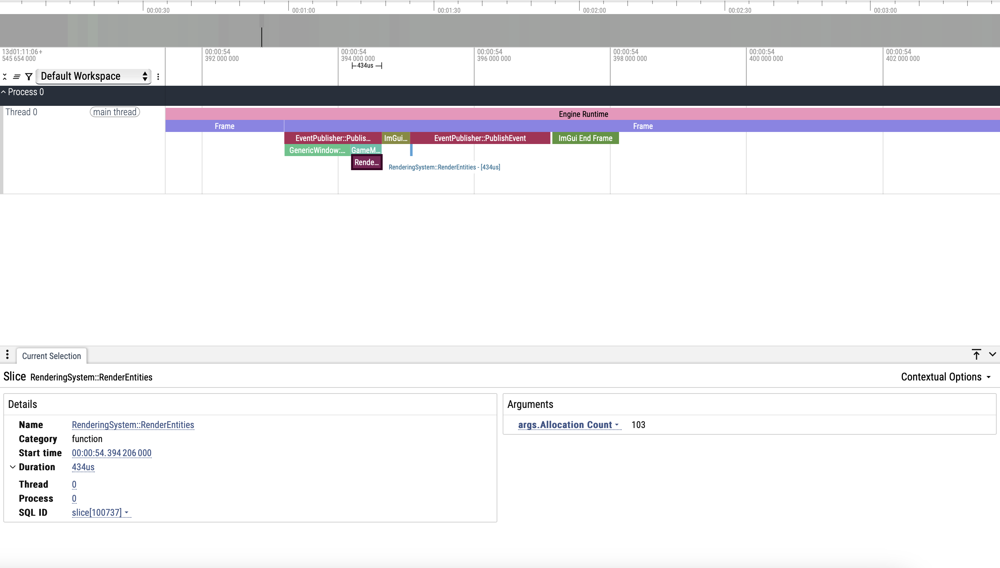
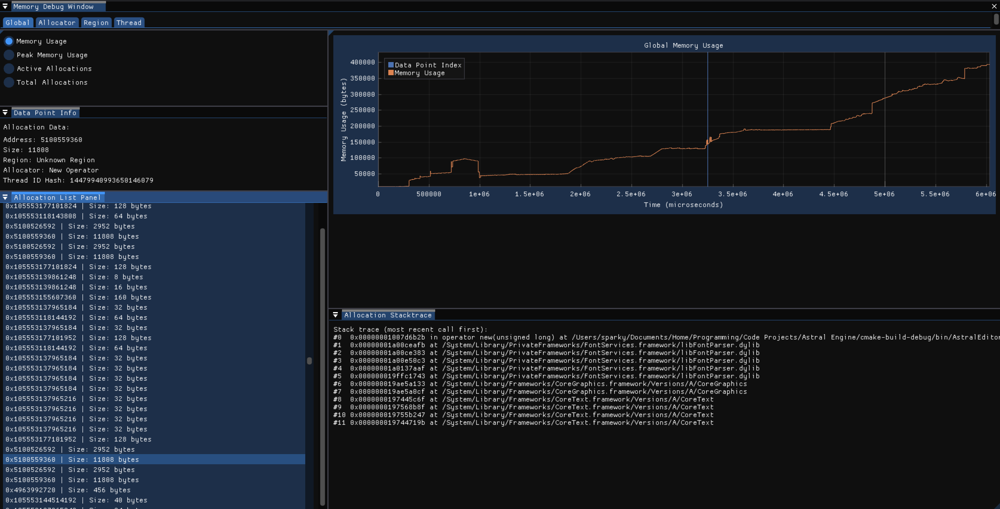
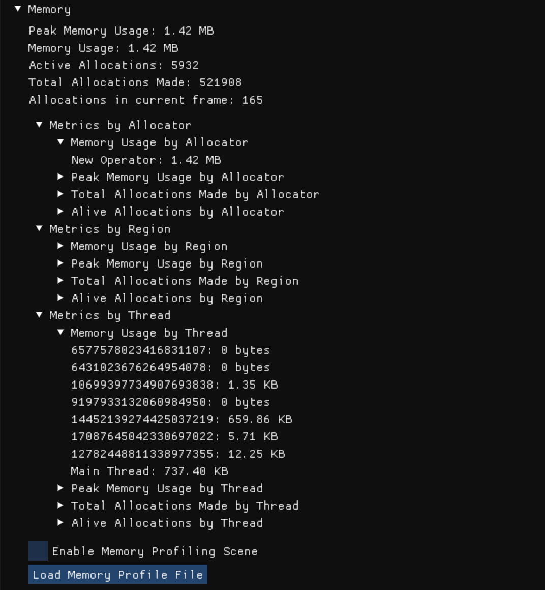

# Astral Memory Tracking System

----

A system to track memory allocations and deallocations with a visual interface.


### Brief Descriptions the Parts of the Memory Tracking System

---

#### GlobalAllocationStorage class

Consists of a tree map that stores the allocation data. This storage allows for the association of pointers to their 
allocation size. This allows for tracking the memory usage by noting the size of allocations when they are allocated 
and freed. The storage also associates pointers with the type of allocator that was used to allocate them, the region
of the engine it was allocated from, and the thread ID of where the allocation took place.

#### MemoryMetrics class

Maintains metrics that track the amount of memory allocations that take place and the size of those allocations. It is
further broken down into number of and size of allocations by thread ID, region of engine, and allocator type in addition
to the global metrics. It also tracks the number of size of allocations per frame.

#### SceneMetricsExporter

Manages exporting the MemoryMetrics class to a file and writes the memory metrics state to a file after every allocation
to allow for viewing the memory metrics of a period of time later.

#### SceneMetricsStorage

Stores the state memory metrics over time. This contains the data of the memory metrics class after every allocation 
was made. This consists of arrays of memory metrics data.

#### SceneMetricsImporter

Manages importing the MemoryMetrics class to a file and parsing the memory profile file into RAM and into a 
usable SceneMetricsStorage instance.

#### MemoryTracker class

Provides the public interface of the memory tracking system and glues all the previous components together.

#### MemoryDebugWindow class

Manages the UI of the memory profiler. This allows the user to view all of the different memory metrics over time
as well as letting the user select each memory allocation and seeing the region of the engine it was allocated in,
the allocator type that made the allocation, the thread it came from, and the stacktrace that led to the allocation.

#### Scope Profiler

A macro is provided to the user to put inside each scope that is being profiled and it uses the constructor and destructor
to measure the time that the scope took to run and also checks the memory tracker metrics at the beginning and end of 
the scope to determine how many allocations are made in the scope. This is then written to a file that can be viewed 
later.

Example Image of the Scope Profiler Trace Output (Using Perfetto)

- Note the number of allocations made in the scope in the bottom right under "Arguments"


### Usage

---

Example of Integrating an Allocator into the MemoryTracker // TODO: Finish this
```c++
Core::MemoryTracker& memoryTracker = Core::MemoryTracker::Get();
memoryTracker.AddAllocation(pointer, size, region, allocatorType); // Adds the allocation to the memory tracking system

memoryTracker.RemoveAllocation(pointer); // Removes the allocation from the memory tracking system
```


#### Example Image of the Memory Debug Window

This shows the visualizer tool that graphs the memory profiling scene data.


#### Example Image of the Engine Debug Menu, Memory Subsection

This shows the real time memory usage metrics of the engine.

###
### Design Process and Considerations

---

#### Why I Made a Memory Tracker and Visualizer + Benefits // TODO: Break this down into smaller sections

Initially, I made a basic memory tracker that would display the memory usage and number of allocations. I noticed that
I was doing more allocations than I thought I would. Additionally, I made the memory tracker and visualizer as a 
natural extension to my allocators I wrote. Because of those two things, I decided to make a more exhaustive memory tracker.
I wanted a memory tracker that would help me profile systems I wrote and sections of the engine. Therefore, I decided to
track memory allocations by the region of the engine and the thread ID to get a better idea of where the allocations are
coming from. Additionally, I also tracked the memory allocations by the type of allocator to get an idea of the trends 
in my engine as well as seeing how many areas of the engine have used more performant allocators than the new operator/malloc.
I think the most important aspect of the memory tracker is that it helps me locate and discover areas with excess amounts
of allocations and their origins, so I can go to the debugger and find a simple solution to remove the allocations if 
there is one or come up with a solution to make the area more performant. This is why I also decided to add stacktraces
to the memory metrics of each allocation. It allows me to see the exact functions and situation that led to these allocations.
Combine this with the other metrics, and it enables me to discover and fix areas of my code that cause an unnecessary 
amount of allocations without the total number of allocations building up into a bigger problem that noticeable affects 
performance of the engine and requires much more time to fix in a scenario without the memory tracker. To extend this tool
further, I also make a visualizer for the memory metrics data. It graphs the allocation data over time to allow the user
to see trends in allocation over time. Additionally, the memory tracker also allows the user to mark their code with
labels to show what is happening in the code, which will show up in the graph on the window to give the user context
of what is happening when there are spikes in allocations in an area. The memory debug window also lets you choose a 
specific allocation and see all the associated data with that allocation. You can also view the memory metrics in
a few different modes which allows the user to view and discover trends in the memory allocations. You can choose between
to graph the memory usage, peak memory usage, active allocations, and total allocations. Furthermore, you can also
choose to view the memory metrics by thread ID, region, or allocator type and the memory debug window will show a 
graph for each thread ID, region, or allocator type, and will also filter the list of allocations that you can select
from to only the allocations in the selected graph.

#### Scope-Based Allocation Tracking

As a part of the memory profiling tool, Astral Engine also provides a scope profiler that allows the user to see how many
allocations are made in any given scope in addition to how long the scope took to execute. The output is written to a file and can be viewed by Chrome's trace tool or
Perfetto's trace tool. An example image is shown earlier in the file under the following section:
Brief Descriptions the Parts of the Memory Tracking System -> Scope Profiler.

#### Thread Safety

The memory tracking system is thread safe by the nature of tracking memory allocations as allocations can happen
on any thread but we need the metrics of the allocation to be stored in a central, single instance of MemoryTracker.
It uses mutexes to ensure that there are no race conditions or other thread related errors. 


#### Performance Issues

The stacktraces are creating performance issues right now. I am going to try and wait to resolve the symbols of the 
stacktraces until the end of the scene recording. That way, I can record scenes during the runtime from the click of a
button instead of having to hard code a limited scene recording due to bad performance.


#### Offline Tool

The visualizer which loads and graphs the memory profiling data is treated as offline tool even though it is currently 
accessed through engine runtime. This means that the performance requirements are not as strict because it is not a 
part of the real time engine. However, there is a real time component to the memory tracking tool as the real time 
memory metrics can be found in the engine's debug menu under the memory subsection.


#### Memory Profile File Format

During a profiling scene, the memory metrics, after each allocation is made, gets written to a file. The file extension
is .ASTLMemProfile. Each write (called a snapshot) is in the following format: The memory metrics instance data, the time of allocation 
(microseconds since the start of the scene), the allocation data struct (data like region, allocation size, thread ID, etc.),
and, lastly, the a string that holds the stacktrace of the allocation. At the footer of the file, there is size_t that
contains the number of snapshots that the file holds. There is no header with data.

Another thing to note is that the library msgpack is used to serialize the data and handles the actual format of the data
inside the file. The above was the order that the data will appear in.


#### Error Handling Strategy

The memory tracker does not throw and return any error codes. However, msgpack will throw exceptions when a cast fails or
another error occurs, so the memory tracker catches anything that is thrown from msgpack.

###
#### References Used:

---

- CppCon 2015: Scott Wardle “Memory and C++ debugging at Electronic Arts”
- Game Engine Architecture (3rd Edition)
- YouTube Video by The Cherno, "Track MEMORY ALLOCATIONS the Easy Way in C++" (https://www.youtube.com/watch?v=sLlGEUO_EGE)